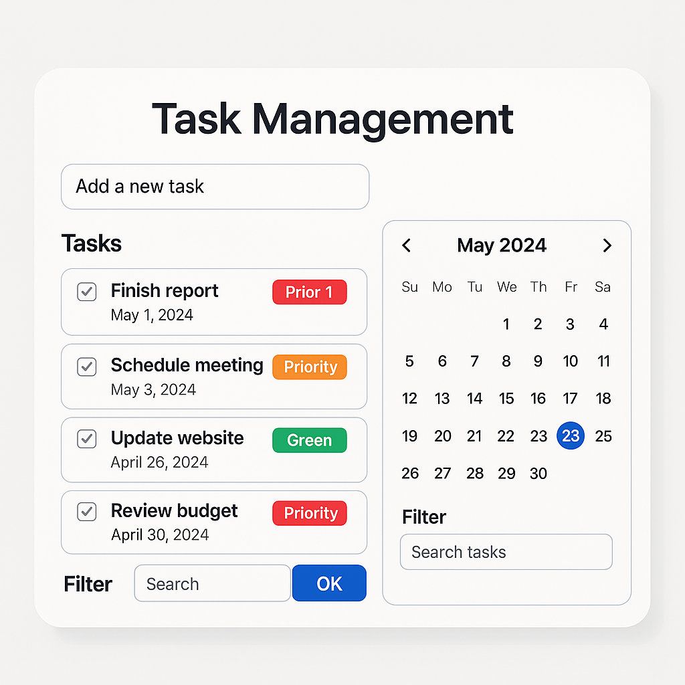

# Project phase 1 - Definition and Planning

## 1. User Personas

### **1.1 Mika, opiskelija (22 v)**  
**Tausta:** Opiskelee tietojenkäsittelytiedettä ja tasapainottelee opintojen ja osa-aikatyön välillä.  
**Tavoite:** Haluaa hallita kurssitehtäviään ja pysyä aikataulussa.  
**Käyttötarve:** Tarvitsee yksinkertaisen tavan lisätä, muokata ja poistaa tehtäviä. Haluaisi mahdollisuuden asettaa määräpäivän tehtäville.  

### **1.2 Laura, projektipäällikkö (35 v)**  
**Tausta:** Johtaa pientä IT-tiimiä ja hallinnoi useita projekteja samanaikaisesti.  
**Tavoite:** Seurata tehtävien etenemistä tiimissä ja varmistaa, että kaikki pysyvät aikataulussa.  
**Käyttötarve:** Tarvitsee mahdollisuuden merkitä tehtävät valmiiksi ja nähdä tehtävälistan selkeästi. Haluaisi suodattaa tehtäviä vastuuhenkilön mukaan.  

### **1.3 Teemu, yrittäjä (40 v)**  
**Tausta:** Pyörittää omaa yritystä ja käsittelee päivittäin monia eri työtehtäviä.  
**Tavoite:** Hallita päivittäisiä työtehtäviä helposti ja tehokkaasti.  
**Käyttötarve:** Haluaa mobiiliystävällisen käyttöliittymän ja mahdollisuuden suodattaa tehtäviä niiden kiireellisyyden mukaan. Toivoisi myös muistutustoimintoa.  

### **1.4 Sanna, koodari (28 v)**  
**Tausta:** Ohjelmistokehittäjä, joka työskentelee useiden projektien parissa yhtä aikaa.  
**Tavoite:** Organisoida ohjelmistokehityksen tehtävät ja koodausprosessit.  
**Käyttötarve:** Tarvitsee mahdollisuuden lisätä tehtävälle prioriteetin sekä mahdollisuuden linkittää tehtävät toisiinsa.  

### **1.5 Antti, freelancer (30 v)**  
**Tausta:** Työskentelee itsenäisenä konsulttina ja hoitaa useita asiakasprojekteja samanaikaisesti.  
**Tavoite:** Hallita useita projekteja yhdellä alustalla ja pitää työt järjestyksessä.  
**Käyttötarve:** Haluaisi kategorisoida tehtävät eri projekteihin ja asettaa niille määräpäiviä.  

## 2. Use Cases and User Flows

### **2.1 Tehtävän lisääminen**  
**Kuvaus:** Käyttäjä lisää uuden tehtävän syöttämällä nimen ja kuvauksen.  
**Vaiheet:**
1. Käyttäjä klikkaa "Lisää tehtävä" -painiketta.
2. Syöttää tehtävän tiedot.
3. Tallenna-painikkeen klikkaus lisää tehtävän listaan.

### **2.2 Tehtävän muokkaaminen**  
**Kuvaus:** Käyttäjä voi muokata aiemmin lisättyä tehtävää.  
**Vaiheet:**
1. Käyttäjä valitsee muokattavan tehtävän.
2. Päivittää tehtävän tiedot.
3. Tallenna-painikkeen klikkaus päivittää tehtävän tiedot.  

### **2.3 Tehtävän poistaminen**  
**Kuvaus:** Käyttäjä voi poistaa tehtävän, jos sitä ei enää tarvita.  
**Vaiheet:**
1. Käyttäjä valitsee poistettavan tehtävän.
2. Vahvistaa poiston.
3. Tehtävä poistetaan tehtävälistasta.  

### **2.4 Tehtävän merkitseminen valmiiksi**  
**Kuvaus:** Käyttäjä voi merkitä tehtävän tehdyksi.  
**Vaiheet:**
1. Käyttäjä valitsee tehtävän.
2. Klikkaa "Merkitse valmiiksi" -painiketta.
3. Tehtävä siirtyy valmiiksi merkityksi.  

### **2.5 Tehtävälistan suodatus**  
**Kuvaus:** Käyttäjä voi suodattaa tehtävälistaa (esim. valmiit, keskeneräiset, prioriteetti).  
**Vaiheet:**
1. Käyttäjä avaa suodatusvalikon.
2. Valitsee halutun suodattimen.
3. Näyttö päivittyy vastaamaan suodatusasetuksia.  

## 3. UI Prototypes

Käyttöliittymä sisältää seuraavat osiot:
- **Tehtävälista**: Näyttää kaikki tehtävät järjestettynä lisäyspäivämäärän tai prioriteetin mukaan.
- **Lisäys/muokkauslomake**: Käyttäjä voi lisätä tai päivittää tehtäviä.
- **Suodatuspaneeli**: Mahdollisuus suodattaa tehtäviä tilan, prioriteetin ja aikarajan mukaan.
- **Valmiiksi merkitseminen**: Käyttäjä voi helposti klikata tehtävän valmiiksi.

UI suunnitellaan responsiiviseksi, jotta se toimii sekä tietokoneella että mobiililaitteilla.

## 4. Information Architecture and Technical Design

### **4.1 Tietomalli**
Tehtävä (Task):
- id (uniikki tunniste)
- title (otsikko)
- description (kuvaus)
- status (valmis/kesken)
- priority (valinnainen)
- created_at (luontiaika)
- due_date (määräpäivä)

### **4.2 Tekninen rakenne**
Frontend:
- React (Vite, TailwindCSS)
- State management: useState

Backend:
- Node.js + Express
- REST API
- SQLite (Tietokanta)

Tietokanta toteutetaan **SQLite**-järjestelmällä, joka on kevyt ja helposti hallittava ratkaisu pienille sovelluksille. Se mahdollistaa yksinkertaisen tiedostopohjaisen tietovaraston ilman erillistä palvelinasennusta.

## 5. Project Management and User Testing

### **5.1 Projektinhallinta**
- Työkalut: GitHub (repositorio + issue tracking), Trello/Jira
- Sprintit: 2 viikon kehitysjaksoja
- Tehtävien jakaminen eri kehitysvaiheisiin (suunnittelu, kehitys, testaus, julkaisu)
- Dokumentaatio päivitetään jokaisen sprintin jälkeen

### **5.2 Käyttäjätestaus**
- Testataan 3–5 käyttäjän kanssa eri käyttäjäpersoonien näkökulmasta
- Palautteen kerääminen ja analysointi haastatteluiden ja lomakkeiden avulla
- Testataan käyttöliittymän selkeyttä, käytettävyyttä ja toiminnallisuuksia
- Iteroidaan käyttöliittymä ja toiminnallisuudet palautteen perusteella
- Kehityksen loppuvaiheessa suoritetaan bugitestaus ja suorituskykytestit

